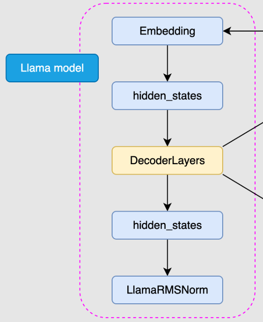
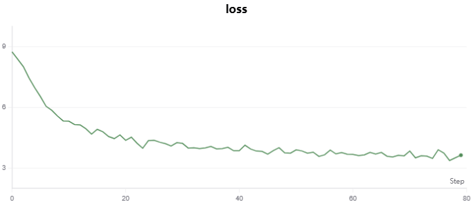
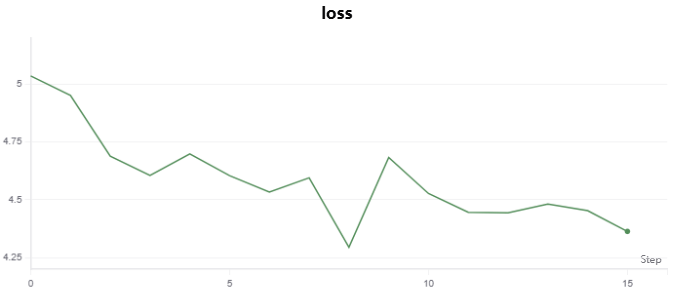
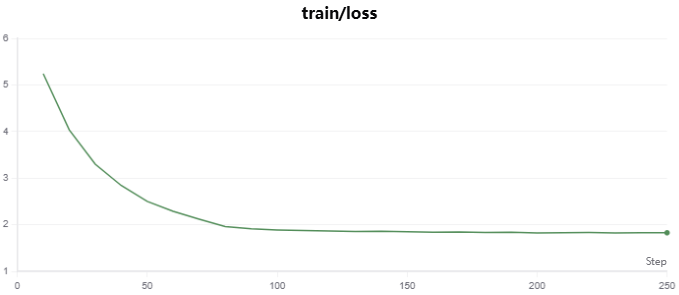

# Happy-LLM 学习与实践报告

- **项目地址：https://github.com/Cl0udTide/happy-llm**

## 实践一：从零搭建和训练一个 LLaMA2 大模型

**目标**: 完整复现《Happy-LLM》第五章的核心流程，在有限的算力资源下，亲手搭建、预训练并监督微调（SFT）一个 Decoder-Only 的 Transformer 模型，并直观对比 Pretrain 和 SFT 阶段模型的行为差异。

### 2.1 模型架构复现

基本沿用了《Happy-LLM》教程中第五章提供的 LLaMA2-like Decoder-Only Transformer 架构代码。

该架构是一个标准的 Decoder-Only Transformer，其核心思想是通过堆叠多个相同的 **Decoder Layer** 来构建深度神经网络，以捕捉文本序列中的复杂依赖关系。

模型整体由以下几个核心部分组成：

<p align="center">    </p>

*   **词嵌入层 (Embedding)**: 将来自分词器的 Token ID 序列映射为高维度的向量表示。
*   **Decoder Layers**: 由多个 `DecoderLayer` 堆叠而成。每个`DecoderLayer`包含**多头注意力**和**前馈神经网络**两个模块

在每个子模块前，会使用 `RMSNorm` 进行层归一化。在**每个子模块处理完成后，其输出会与模块的输入进行相加** （即残差连接），以帮助梯度在深层网络中有效传播，缓解梯度消失问题。最后应该还有一个最终的**线性输出层**，接受经过归一化后的`DecoderLayers`的输出，并将其投影回词汇表空间，得到用于预测下一个 Token 的概率表。

### 以 Attention 模块为例

LLaMA 的 Attention 模块比较特殊，采用了旋转位置编码（RoPE）与**分组查询注意力（Grouped-Query Attention, GQA）**。

RoPE 负责在计算注意力分数前将相对位置信息融入到 Query 和 Key 向量中，而 GQA 则是一种优化，通过让多组查询头共享键/值头来降低计算和显存开销。 Attention 模块的前向传播流程如下所示：

```python
def forward(self, x: torch.Tensor, freqs_cos: torch.Tensor, freqs_sin: torch.Tensor):
    
    bsz, seqlen, _ = x.shape

    # ----------------- 1. 线性投影，计算 Q, K, V -----------------
    # 使用独立的线性层 (wq, wk, wv) 将输入的张量 x 投影到三个不同的子空间，
    # 分别生成 Query, Key, Value 向量。
    # xq 的形状: (bsz, seqlen, n_heads * head_dim)
    # xk, xv 的形状: (bsz, seqlen, n_kv_heads * head_dim)
    xq, xk, xv = self.wq(x), self.wk(x), self.wv(x)
    
    # ----------------- 2. 多头注意力：维度拆分 -----------------
    # 将 Q, K, V 的最后一个维度拆分为 (头数, 每个头的维度)，
    # 为并行的多头注意力计算做准备。
    # xq 形状变为: (bsz, seqlen, n_local_heads, head_dim)
    # xk, xv 形状变为: (bsz, seqlen, n_local_kv_heads, head_dim)
    xq = xq.view(bsz, seqlen, self.n_local_heads, self.head_dim)
    xk = xk.view(bsz, seqlen, self.n_local_kv_heads, self.head_dim)
    xv = xv.view(bsz, seqlen, self.n_local_kv_heads, self.head_dim)

    # ----------------- 3. 融入位置信息：应用旋转位置嵌入 (RoPE) -----------------
    # RoPE 是一种相对位置编码方法，通过旋转 Query 和 Key 向量来注入位置信息。
    # 只作用于 Q 和 K，因为位置信息用于计算注意力分数（相似度），而 V 仅包含待聚合的内容。
    xq, xk = apply_rotary_emb(xq, xk, freqs_cos, freqs_sin)

    # ----------------- 4. GQA ：复制 K, V 头以匹配 Q 的头数 -----------------
    # 在分组查询注意力 (GQA) 中，K 和 V 的头数 (n_kv_heads) 少于 Q 的头数 (n_heads)。
    # `repeat_kv` 函数将 K 和 V 的头复制 n_rep 次，使其头数与 Q 匹配，
    # 多个查询头可以共享同一组键/值头，减少了参数量，进而减少计算量和内存占用。
    # xk, xv 形状变为: (bsz, seqlen, n_local_heads, head_dim)
    xk = repeat_kv(xk, self.n_rep)
    xv = repeat_kv(xv, self.n_rep)
    
    # 为了进行批处理矩阵乘法，将 `seqlen` 和 `n_heads` 维度进行转置。
    # 形状变为: (bsz, n_local_heads, seqlen, head_dim)
    xq = xq.transpose(1, 2)
    xk = xk.transpose(1, 2)
    xv = xv.transpose(1, 2)

    # ----------------- 5. 注意力计算：因果掩码 -----------------
    # 用Pytorch的内置函数实现 Q, K, V 的点积、缩放、掩码、softmax 和与 V 的加权求和。
    # `is_causal=True` ，自动应用因果掩码。
    output = torch.nn.functional.scaled_dot_product_attention(
        xq, xk, xv, attn_mask=None, 
        dropout_p=self.dropout if self.training else 0.0, 
        is_causal=True
    )

    # ----------------- 6. 输出整合：将多头结果拼接并通过输出线性层 -----------------
    # 将所有头的输出拼接在一起，恢复到 `(bsz, seqlen, dim)` 的形状。
    # (bsz, n_heads, seqlen, head_dim) -> (bsz, seqlen, n_heads, head_dim) -> (bsz, seqlen, dim)
    output = output.transpose(1, 2).contiguous().view(bsz, seqlen, -1)
    
    # 通过最后一个线性层 `wo` 对拼接后的多头输出进行最终的线性变换，
    # 整合并融合所有头的信息。
    output = self.wo(output)
    
    return output
```

### 2.2 实验适配

受限于实验环境（Google Colab T4 GPU，约 15GB 显存），教程中即便是小型的两亿参数模型也无法直接进行训练。因此，为了能在有限的硬件资源下完整地跑通预训练和SFT的全流程，我对模型参数和训练数据都进行了相应的调整。

**1. 模型参数调整**

为了显著降低显存占用，我大幅度调低了模型的各项核心参数，主要调整如下：

*   **模型维度 (dim)**: 从 1024 降至 256
*   **层数 (n_layers)**: 从 18 降至 4
*   **注意力头数 (n_heads)**: 从 16 降至 4
*   **词汇表大小 (vocab_size)**: 设定为 6144 （使用教程提供的 Tokenizer）
*   **最大序列长度 (max_seq_len)**: 从 512 降至 256

通过这些调整，最终将模型参数量控制在了约 **500 万**，确保在 T4 GPU 上可以顺利进行训练。

**2. 数据集选择与处理**

考虑到教程提供的数据集过大，不适合调低参数后的模型。我选择了两个更小的中文数据集，并各取了一部分子集用于本次实验。

*   **预训练数据集**: 我选择了 [**pleisto/wikipedia-cn-20230720-filtered**](https://huggingface.co/datasets/pleisto/wikipedia-cn-20230720-filtered)，这是一个经过清洗的中文维基百科数据集。它包含大量高质量的陈述性文本，非常适合用于让模型学习语言结构、语法和世界知识。
*   **SFT 数据集**: 我选择了 [**c-s-ale/alpaca-gpt4-data-zh**](https://huggingface.co/datasets/c-s-ale/alpaca-gpt4-data-zh)，这是一个包含由 GPT-4 生成的中文指令微调数据集。其“指令-回答”的格式非常适合用于教会模型如何遵循人类指令进行对话。

为了将这两个数据集适配到我们的模型训练流程中，我分别在 `dataset.py` 中实现了 `PretrainDataset` 和 `SFTDataset` 类。其核心的数据处理流程体现在各自的 `__getitem__` 方法中。

#### 2.2.1 预训练数据处理 (`PretrainDataset`)

处理标准的 **CLM** 任务，让模型学习预测下一个词。

```python
# dataset.py: PretrainDataset
def __getitem__(self, index: int):
    # 1. 根据索引加载单条 JSON 格式的文本数据。
    sample = json.loads(self.data[index])
    
    # 2. 提取文本内容，并在开头添加起始符 (BOS token)，标志序列开始。
    # 对于数据集，'completion' 字段为需要的文本数据
    text = f"{self.tokenizer.bos_token}{sample['completion']}"
    
    # 3. 使用分词器将文本转换为 Token ID 序列，并截断至最大长度 `max_length`。
    input_id = self.tokenizer(text).data['input_ids'][:self.max_length]
    
    # 4. 计算序列的实际长度和需要填充的长度。
    text_len = len(input_id)
    padding_len = self.max_length - text_len
    
    # 5. 对序列进行填充，使其长度达到 `max_length`。填充值为 0。
    input_id = input_id + [self.padding] * padding_len
    
    # 6. 构建损失掩码 (loss mask)。真实 Token 的位置为 1 (需要计算损失)，填充部分为 0 (不计算损失)。
    loss_mask = [1] * text_len + [0] * padding_len

    # 7. 将处理好的 `input_id` 转换为 NumPy 数组，为转换为 PyTorch 张量做准备。
    input_id = np.array(input_id)
    
    # 8. 构建模型的输入 `X`：取 `input_id` 的前 n-1 个 Token。
    X = np.array(input_id[:-1]).astype(np.int64)
    
    # 9. 构建模型的目标 `Y` (标签)：取 `input_id` 的后 n-1 个 Token，形成错位预测。
    Y = np.array(input_id[1:]).astype(np.int64)
    
    # 10. 同样对 `loss_mask` 进行错位，使其与 `Y` 对齐。
    loss_mask = np.array(loss_mask[1:]).astype(np.int64)
    
    # 11. 将 NumPy 数组转换为 PyTorch 张量并返回。
    return torch.from_numpy(X), torch.from_numpy(Y), torch.from_numpy(loss_mask)

# 被截断的输入在这个过程中就丢失了，更好的做法是对输入进行打包\分块。
```

#### 2.2.2 SFT 数据处理 (`SFTDataset`)

处理 **指令遵循** 任务，其核心在于通过 `loss_mask` 精确控制模型只在“回答”部分学习。

```python
# dataset.py: SFTDataset
def __getitem__(self, index: int):
    # 1. 加载单条 JSON 格式的指令数据。
    sample = json.loads(self.data[index])
    
    # 2. 从样本中提取 'instruction', 'input', 和 'output' 字段。
    instruction = sample.get("instruction", "")
    input_text = sample.get("input", "")
    output_text = sample.get("output", "")
    
    # 3. 将 'instruction' 和 'input' 合并为用户的完整提问内容。
    user_content = instruction
    if input_text:
        user_content += "\n" + input_text
    messages = [{"role": "user", "content": user_content}]

    # 4. 使用 `apply_chat_template` 将用户提问格式化并转换为 Token ID。
    # `add_generation_prompt=True` 会自动添加引导模型开始回答的前缀 (如 `<|im_start|>assistant\n`)。
    prompt_ids = self.tokenizer.apply_chat_template(
        messages, 
        add_generation_prompt=True, 
        tokenize=True, 
        add_special_tokens=False
    )

    # 5. 单独对模型的期望回答进行分词。
    output_ids = self.tokenizer(output_text, add_special_tokens=False)['input_ids']
    
    # 6. 在回答的末尾手动添加结束符 (EOS token)，表示回答结束。
    output_ids.append(self.tokenizer.eos_token_id)
    
    # 7. 将用户提问和模型回答的 Token ID 序列拼接，形成完整的输入序列。
    input_id = prompt_ids + output_ids
    
    # 8. 对拼接后的完整序列进行截断，确保不超过最大长度。
    input_id = input_id[:self.max_length]
    
    # 9. 构建核心的 Loss Mask：
    #    为用户提问部分 `prompt_ids` 创建全 0 的掩码（不计算损失），
    #    为模型回答部分 `output_ids` 创建全 1 的掩码（计算损失）。
    loss_mask = [0] * len(prompt_ids) + [1] * len(output_ids)
    
    # 10. 同样对 loss mask 进行截断，以匹配 `input_id` 的长度。
    loss_mask = loss_mask[:self.max_length]

    # 11. 对 `input_id` 和 `loss_mask` 进行填充，使其长度统一为 `max_length`。
    padding_len = self.max_length - len(input_id)
    input_id = input_id + [self.padding] * padding_len
    loss_mask = loss_mask + [0] * padding_len
    
    # 12. 与预训练数据处理类似，将 `input_id` 错位拆分为 `X` 和 `Y`，
    #     并对 `loss_mask` 做同样处理，最后转换为 PyTorch 张量返回。
    input_id = np.array(input_id)
    X = np.array(input_id[:-1]).astype(np.int64)
    Y = np.array(input_id[1:]).astype(np.int64)
    loss_mask = np.array(loss_mask[1:]).astype(np.int64)
    
    return torch.from_numpy(X), torch.from_numpy(Y), torch.from_numpy(loss_mask)

# 其实标准做法是通过设置 label 为 `ignore_index` 来控制损失计算。这里采用 loss_mask 在这种情况下更直观与方便些。
```

### 2.3 训练过程与结果分析

在完成模型和数据的适配后，我分别进行了预训练（Pretrain）和监督微调（SFT）两个阶段的训练。

#### 1. 训练过程

**预训练 (Pre-training):**
使用随机初始化的模型在维基百科子集上进行训练。从Loss曲线上看，初始Loss值很高（约9.0），符合随机状态。随后Loss曲线呈现出清晰且持续的下降趋势，表明模型正在从数据中学习语言的基本模式。

<p align="center">    </p>

**监督微调 (Supervised Fine-Tuning, SFT):**
加载预训练好的权重，在Alpaca指令数据集上进行微调。SFT阶段的初始Loss较低（约5.1），因为模型已具备了预训练阶段学到的基础能力。整个下降过程相对平缓并伴有波动，符合模型从文本续写向指令遵循的方向进行调整的规律。

<p align="center">    </p>

#### 2. 生成结果

由于本次实验的模型规模（约500万参数）和训练数据量都极为有限，两个阶段最终生成的文本内容在语义上都是不连贯且无意义的。

*   **Pretrain 模型**:
    *   **输入**: `"中国的首都是哪里？"`
    *   **输出**: `。在《江西》中,其主是“泰美”、“砖庆”、“光石”。 玾建如《江西》,“郑藤之佐之经`

*   **SFT 模型**:
    *   **输入**: `### Instruction:\n中国的首都是哪里？\n\n### Response:\n`
    *   **输出**: `1. 中幻: 饰 大理 3. 春: 迪: 2. 北大档 3. 俄罗 5. 下: 王归`

然而，尽管生成内容质量不佳，依旧能够从两个模型的输出中，感受到模型行为模式上的差异。预训练阶段的模型展现出的是一种纯粹的**文本续写**行为，它将输入的问题视为一段前文，并机械地生成了统计上可能跟随其后的文本片段，而不是尝试回答输入的问题。相比之下，经过监督微调的模型则初步学会了**格式对齐**，它的输出虽然内容无意义，但呈现出一种带编号的列表形式，说明模型不是在尝试续写，而是在根据从指令微调数据中学习到的规律，尝试回答输入的问题。

这种行为上的转变清晰地揭示了两个训练阶段的不同作用：预训练负责**构建**模型的基础语言能力，而SFT则负责**对齐**模型的行为，使其学会如何遵循指令。

## 实践二：LoRA 微调探索

**目标**: 在算力受限的个人设备上（NVIDIA 4060 Laptop），利用高效的 QLoRA 技术，将一个小型边缘端的通用多语言 LLM (`LiquidAI/LFM2-1.2B`)，微调成一个能生成特定风格（中文五言绝句）的“AI诗人”。

### 2.1 核心技术与环境

为了在 8GB 显存的消费级显卡上微调一个 1.2B 参数量的模型，本次实践采用了 **QLoRA** 技术。它结合了量化与低秩适配，实现了在有限资源下的高效微调：

1.  **4-bit 量化**: 使用 `bitsandbytes` 库将模型权重从标准的 16-bit 浮点数量化为 4-bit 整数，极大地压缩了模型在显存中的体积。
2.  **LoRA**: 在量化后的模型上，冻结全部原始参数，仅在 Transformer 的关键模块旁添加小型的、可训练的低秩适配器矩阵。训练过程只更新这些适配器参数，而参数量仅占原始模型的极小一部分（本次实验中为 **0.0755%**）。

与实践一中只使用`PyTorch`从零构建的方式不同，这次实践**依托 Hugging Face 生态**，使用 `PyTorch` 作为后端，`transformers` 库加载模型与 Tokenizer，`peft` 库实现 QLoRA，并使用 `trl` 库中的 `SFTTrainer` 简化训练流程。

### 2.2 数据集构建与迭代

本次实验使用的数据集为 `Lifan-Z/Chinese-poetries-txt` 中的五言绝句部分。为了让模型能理解并遵循“作诗”这一指令，我将原始的纯文本诗歌数据，通过一个预处理函数 `preprocess_function` 转换为了符合模型聊天模板的对话格式。

该函数的核心逻辑是：对每首诗，使用 `jieba` 自动提取 1-3 个名词作为关键词，并围绕这些关键词构建一个“用户指令”（User Instruction），将原始诗歌作为“模型回答”（Assistant Response）。

```python
# finetune_poet_lora.ipynb: preprocess_function
def preprocess_function(example):
    # ... (省略文本清理和关键词提取部分) ...
    
    # 3. 构造指令
    if nouns:
        # 随机选择1-3个名词作为关键词
        num_keywords = min(len(nouns), 3)
        selected_keywords = random.sample(nouns, num_keywords)
        keyword = "、".join(selected_keywords)
        instruction = f"请为我创作一首关于“{keyword}”的五言绝句。"
    else:
        # 如果没有提取到名词，就用一个通用指令
        instruction = "请为我创作一首经典的五言绝句。"

    # 4. 转换为 Chat Template 结构的数据
    example["messages"] = [
        {"role": "system", "content": "你是一位才华横溢的中国古代诗人。"},
        {"role": "user", "content": instruction},
        {"role": "assistant", "content": poem_text}
    ]
    return example

# SFTTrainer在接收到这样的数据时，会自动应用Chat Template，然后调用 Tokenizer。
# 并根据指令微调的要求，自动设置好 loss_mask 和 label，所以数据预处理只需要构造符合格式的字典数据就可以了。
```

在构建数据集的过程中，我遇到了问题并进行了数次迭代：

1. **初版尝试：** 最初，我我直接将单行四句的诗歌作为模型回答。结果发现，模型在生成时常常只输出两句就提前终止。分析原因可能是源于模型的**预训练惯性**，即在海量数据中，单行文本内的句号“。”后紧跟结束符（EOS）的概率很高，而仅靠微调难以完全扭转这一强大先验。

2. **结构修正：** 为了解决提前终止的问题，我调整了数据格式，将一首诗拆分为四行，并只在最后一行的末尾显式添加 `tokenizer.eos_token`，向模型清晰地界定了一首古诗的结构边界，有效解决了生成不完整的问题。

3. **风格优化：** 在第二版的基础上，我进一步优化了 `system` 角色的提示词，将原本的 `You are a helpful assistant trained by Liquid AI. ` 修改为 `你是一位才华横溢的中国古代诗人`。通过赋予模型一个更明确的人设，引导其生成更具古风韵味的文本，最终略微提高了模型的表现。

   最终的数据格式示例如下：

   ```json
   [
     {"role": "system", "content": "你是一位才华横溢的中国古代诗人。"},
     {"role": "user", "content": "请为我创作一首关于“烧灰、长江、檀那”的五言绝句。"},
     {"role": "assistant", "content": "来年二月二，\n与汝暂相弃。\n烧灰散长江，\n勿占檀那地。\n<|im_end|>"}
   ]
   ```

### 2.3 PEFT流程实现

与“实践一”中手动编写训练循环不同，本次实验充分利用了 `transformers` 和 `trl` 库提供的高效 API，极大地简化了代码。

**1. QLoRA 模型加载**

通过 `BitsAndBytesConfig` 配置 4-bit 量化参数，并在 `from_pretrained` 中直接传入，即可轻松加载一个量化后的模型。随后，使用 `peft` 库的 `LoraConfig` 定义适配器参数，并用 `get_peft_model` 将 LoRA 适配器“注入”到量化模型中。

```python
# finetune_poet_lora.ipynb: Part 2

# --- 1. 配置 QLoRA (4-bit 量化) ---
bnb_config = BitsAndBytesConfig(
    load_in_4bit=True,
    bnb_4bit_use_double_quant=True,
    bnb_4bit_quant_type="nf4",
    bnb_4bit_compute_dtype=torch.bfloat16
)

# --- 2. 加载 4-bit 量化后的基础模型 ---
model = AutoModelForCausalLM.from_pretrained(
    model_path,
    quantization_config=bnb_config,
    device_map="auto",
    attn_implementation="flash_attention_2" # 使用 Flash Attention 2 加速
)

# --- 4. 定义 LoRA 配置 ---
lora_config = LoraConfig(
    r=16,
    lora_alpha=32,
    target_modules=["q_proj", "v_proj", "k_proj", "o_proj"], # 在注意力投影层应用LoRA
    lora_dropout=0.05,
    bias="none",
    task_type="CAUSAL_LM"
)

# 教程中提到，"通过消融实验发现同时调整 W_q 和 W_v会产生最佳结果"。
# 不过这种 "最佳效果" 我理解指的是具有最高的 "性价比"。
# 这里在所有注意力投影层应用LoRA，可训练参数的增长微乎其微，但是可以换取模型更高的性能上限。

# --- 5. 将 LoRA 注入到模型中 ---
lora_model = get_peft_model(model, lora_config)

# 打印可训练参数，验证 LoRA 是否生效
lora_model.print_trainable_parameters()
# trainable params: 884,736 || all params: 1,171,225,344 || trainable%: 0.0755
```

**2. 使用 `SFTTrainer` 进行训练**

`trl` 库的 `SFTTrainer` **将繁琐的训练细节封装成了一个简洁易用的高级工具**。我们只需通过 `SFTConfig` (继承自 `TrainingArguments`) 定义好所有训练超参数（如学习率、批大小、保存策略等），然后将模型、数据集和配置三者传入 `SFTTrainer` 即可。它会自动处理数据、梯度累积、学习率调度、日志记录、模型保存等所有复杂的训练细节。

```python
# finetune_poet_lora.ipynb: Part 3

# --- 1. 配置训练参数 ---
training_args = SFTConfig(
    output_dir="./outputs/lfm2_poet_lora",
    num_train_epochs=3,
    per_device_train_batch_size=2,
    gradient_accumulation_steps=8, # 有效 batch size = 16
    optim="paged_adamw_8bit",      # QLoRA 推荐的优化器
    learning_rate=2e-4,
    lr_scheduler_type="cosine",
    logging_steps=10,
    save_steps=50,
    bf16=True,                     # 启用 bfloat16 混合精度
    packing=True,                  # 启用 packing
    report_to="swanlab"            # 使用 swanlab 追踪实验
)

# --- 2. 创建 Trainer 实例 ---
trainer = SFTTrainer(
    model=lora_model,
    args=training_args,
    train_dataset=train_dataset,
    eval_dataset=eval_dataset
)

# --- 3. 一行代码启动训练 ---
trainer.train()
```

### 2.4 训练过程与结果分析

#### 1. 训练过程

模型在所有 17521 首五言绝句上训练了 3 个 Epoch。通过 SwanLab 追踪的训练曲线可以看出，Loss 从初始的约 5.2 稳步下降并收敛至 1.8 左右，整个过程平滑，说明模型在诗歌数据上进行了有效的学习。

<p align="center">    </p>

#### 2. 微调结果

微调前后，模型的行为发生了根本性的转变。面对相同的指令，微调前的基座模型虽然也尝试生成诗歌，但其风格更接近**形式自由、缺少格律的现代诗**。相比之下，微调后的模型则展现出**遵循五言绝句格式的明确倾向**。

* **指令**: `请为我创作一首关于“落叶”的五言绝句。`

* **LFM2 (微调前)**:

  > 秋叶飘零舞，落地静谧。
  >
  > 寒风拂面，余晖轻抚。
  >
  > 落叶纷飞，岁月轻遥。
  >
  > 诗人凝视，心在落叶间。

* **LFM2 (微调后)**:

  > 落叶不再落，
  >
  > 秋风无声凋。
  >
  > 春日不如花，
  >
  > 秋日未见花。

#### 3. 分析与总结

从对比结果可以清晰地看到，微调前的模型虽能理解“落叶”的意象，但其生成的更像是缺乏古典格律的现代诗歌。而经过 QLoRA 微调后，模型的核心转变体现在两个方面：首先是**格式对齐的倾向**，它学会了生成“五言四句”这一结构（尽管偶尔会有偏差）；其次是在**语言风格**上向古诗词靠拢，产出了更具韵味的内容。

这次实践验证了 QLoRA 技术的强大之处：即使在条件有限有限的消费级硬件上，也能对一个数十亿参数的模型进行有效微调，并使其在特定领域（如古诗生成）的能力得到显著增强。同时，Hugging Face 生态提供的高级 API 也大大降低了实现复杂训练流程的门槛。

## 实践三：搭建一个简单的RAG 系统

**目标**: 亲手搭建一个基础的检索增强生成（RAG）系统，利用外部知识库，解决大语言模型面对特定、非公开信息时产生的幻觉或知识过时问题，对比体会 RAG 对模型回答质量的提升。

### 3.1 RAG 简介与实现思路

大语言模型（LLM）的知识来源于其训练数据，因此存在知识截止日期，并且对私有或未公开的特定领域知识一无所知。当被问及这些信息时，它们可能会生成不准确的、看似合理但实则错误的内容（即“幻觉”）。RAG 是一种有效的解决方案，它将外部知识库的检索能力与 LLM 的强大生成能力相结合，为模型提供生成答案所需的事实依据。

这次实践手动实现了一个完整的 RAG 流程，可分为三个核心步骤：

1.  **索引 (Indexing)**: 将我们的私有知识文档（`knowledge_base.txt`）切分成小块（Chunks），然后使用 Gemini 的 `gemini-embedding-001` 模型将每个文本块转换为高维向量（Embedding），以此构建一个基础的向量知识库。
2.  **检索 (Retrieval)**: 当用户提出问题时，使用相同的嵌入模型将问题向量化，然后通过计算余弦相似度，从向量知识库中找出与问题语义最相关的知识块。
3.  **生成 (Generation)**: 将检索到的知识块作为上下文（Context），与用户的原始问题一起，通过一个精心设计的提示词（Prompt）模板，提交给 Gemini 的 `gemini-2.5-flash-lite` 模型，由模型基于提供的上下文生成最终答案。

### 3.2 核心组件实现

本次实践的所有功能均通过 `google-generativeai` 库实现，代码简洁直观。

**1. 索引与检索**

定义了 `get_embeddings` 和 `retrieve_top_k_chunks` 两个关键函数。前者负责调用 `gemini-embedding-001` 模型进行向量化，后者则利用 `scikit-learn` 的 `cosine_similarity` 函数，在所有文档向量中快速找到与问题向量最相似的一个或多个。

```python
# rag_practice.ipynb: Part 4

# --- 1. 定义向量化函数 ---
def get_embeddings(texts, model_name="gemini-embedding-001", task_type="retrieval_document"):
    """使用 Gemini Embedding 模型将文本块向量化"""
    return genai.embed_content(
        model=model_name,
        content=texts,
        task_type=task_type
    )['embedding']

# --- 2. 定义检索函数 ---
def retrieve_top_k_chunks(query_embedding, doc_embeddings, docs, k=1):
    """根据查询向量，检索最相似的 k 个文档块"""
    # 计算查询向量与所有文档向量的余弦相似度
    sims = cosine_similarity([query_embedding], doc_embeddings)[0]
    # 获取相似度最高的 k 个索引
    top_k_indices = np.argsort(sims)[-k:][::-1]
    return [docs[i] for i in top_k_indices]
```

**2. 增强生成**

构建了一个模板，明确指示模型必须**基于提供的上下文**来回答问题，如果上下文中没有答案，就直接承认不知道。**这种指令能有效约束模型的生成行为，使得模型能严格遵循所提供的上下文进行回答并减少“幻觉”。**

```python
# rag_practice.ipynb: Part 4

def generate_answer_with_rag(query, context, model_name="gemini-2.5-flash-lite"):
    """使用检索到的上下文来增强 LLM 的生成"""
    prompt = f"""
    请根据以下上下文信息，来回答用户的问题。
    如果你在上下文中找不到答案，就说你不知道。

    上下文:
    ---
    {context}
    ---

    问题: {query}
    """
    model = genai.GenerativeModel(model_name)
    response = model.generate_content(prompt)
    return response.text
```

### 3.3 结果分析

为了验证 RAG 的效果，我创建了一个仅包含 `Happy-LLM` 项目介绍的本地知识库，并向模型提出了一个关于该项目具体章节内容的问题。这是一个公开模型应该不知道答案的问题。

*   **问题**: `Happy-LLM 教程的第五章和第七章主要讲了什么内容？`

#### 1. 无 RAG 回答

直接向 `gemini-2.5-flash-lite` 模型提问，它非常坦诚地承认**无法直接找到一个名为 "Happy-LLM" 的教程**，接着基于其通用知识库，开始泛化地推测一个 LLM 教程可能包含的内容。其回答虽然详尽，对解决用户的具体问题的帮助有限。

> **【不使用 RAG 的回答】:**
>
> 关于“Happy-LLM”这个教程，我需要**澄清一个信息**：**目前我无法直接找到一个名为“Happy-LLM”的官方、公开且广为流传的教程。**
>
> 因此，我无法确切地告诉你它的第五章和第七章讲了什么。
> ...
> **在我获得更多信息之前，我只能提供一些关于LLM教程普遍会涵盖的内容的可能性...**

#### 2. 使用 RAG 后的回答

在 RAG 流程下，系统首先准确地从知识库中检索到了描述第五章和第七章内容的文本块。然后，模型基于这些精准的上下文，给出了简洁且完全符合事实的回答，成功解决了问题。

> **【使用 RAG 的回答】:**
>
> 根据提供的上下文信息：
>
> *   **第五章** 的主题是“动手实现一个 LLaMA2 大模型”。在这一章，读者将使用 PyTorch，从零开始亲手构建 LLaMA2 的每一个核心组件，包括 RMSNorm、旋转位置编码（RoPE）、分组查询注意力（GQA）以及 SwiGLU 前馈网络。
>
> *   **第七章** 聚焦于 LLM 的高级应用，详细介绍了两大前沿技术：检索增强生成（Retrieval-Augmented Generation, RAG）和智能体（Agent）。RAG 部分解释了如何通过外挂知识库来解决 LLM 的局限性。

#### 3. 分析与总结

综上所述，通过本次 RAG 实践，我亲身体验了如何通过“检索-生成”这一简洁的范式，以 “外挂” 方式为通用大模型提供特定领域知识。该方法无需对模型进行任何微调，便能有效克服其知识局限性和内容幻觉问题。**对于需要快速响应知识更新或处理私有数据的应用而言，这无疑是一条极具价值且易于实现的技术路径。**
